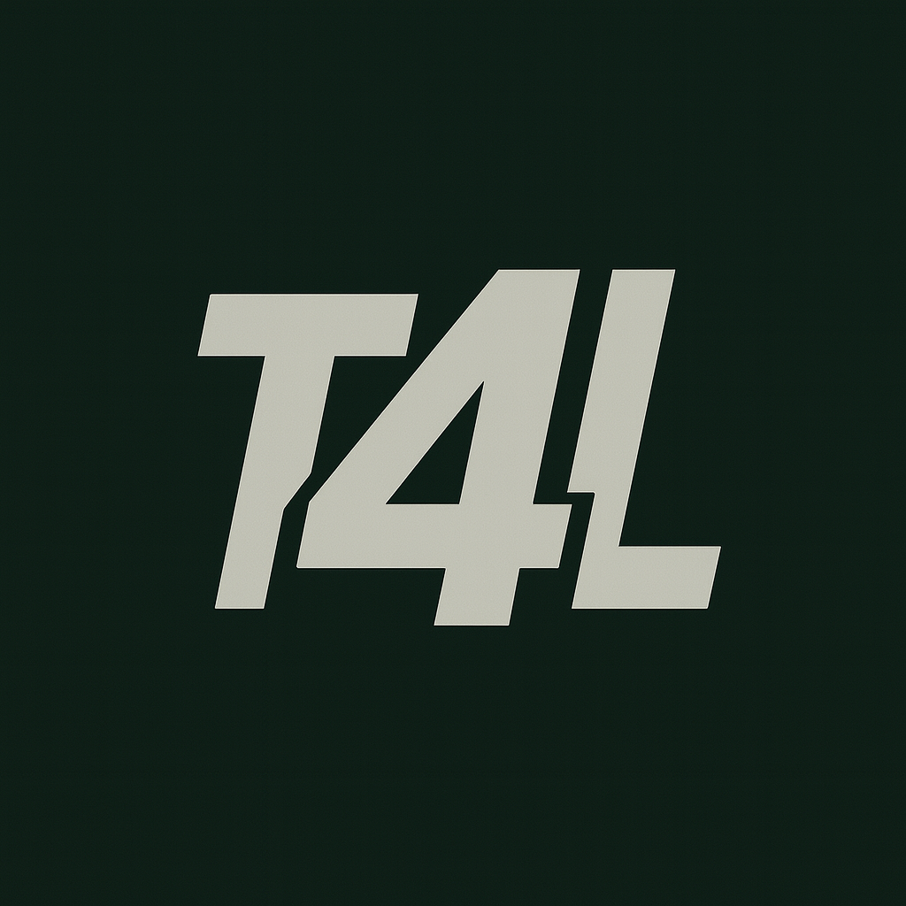

<p align="center">
  
</p>

# Tackle4Loss OS 🏈

<p align="center">
  
  
  
</p>


> [!NOTE]
> **Tackle4Loss OS** is a premium NFL fan experience architected as a **Micro-App Operating System**. Instead of a traditional navigation app, we built a custom "OS Shell" that hosts independent, modular applications with high-fidelity design.


## 🏗️ Architecture: The "OS Shell"

The core of the application is the **OS Shell** (`lib/core/os_shell/`). It acts as a mini-operating system within the app, providing:

*   **Horizontal App Strip**: A sleek, scrollable list of installed apps for quick access and streamlined navigation.
*   **Dock**: A persistent floating navigation bar.
*   **News Feed**: An infinite-scrolling feed of personalized news, videos, and articles integrated directly into the homescreen.
*   **Team Center**: A comprehensive overlay for team intelligence, featuring Roster, Depth Charts, Injury Reports, and a Games Timeline.
*   **System Services**:
    *   `InstalledAppsService`: Manages which apps are "installed" on the user's grid.
    *   `AppRegistry`: The central database of all available MicroApps.
    *   `NavigationService`: Handles switching between apps and the shell.
    *   `FeatureFlagService`: Controls the visibility and availability of features and micro-apps.

This architecture allows us to build features as completely standalone **MicroApps** that plug into the shell.

## ☁️ Backend & Data

The application leverages **Supabase Edge Functions** for high-performance, server-side logic:
*   **Data Aggregation**: Functions like `get-team-roster`, `get-team-injuries`, and `get-team-depth-chart` aggregate live NFL data.
*   **Game Logic**: `get-daily-player` ensures a synchronized daily challenge for all Wordle users.
*   **Content Delivery**: `get-news-feed` and `get-team-article-detail` serve dynamic content.

---

## 📱 MicroApps

The app comes pre-loaded with a suite of powerful MicroApps. Visibility and deployment of these apps are managed via **Feature Flags**.

### [1. App Store 🛍️](lib/micro_apps/app_store/README.md)
The heart of the ecosystem. The App Store allows users to discover and install new features.
*   **Purpose**: Manages the "installed" state of other apps.
*   **Key Feature**: "App of the Month" promotion and seamless one-tap installation.

### [2. Deep Dives 🌊](lib/micro_apps/deep_dive/README.md)
The premier content experience. Long-form, immersive reading with rich media.
*   **Purpose**: Delivers high-quality analysis and storytelling.
*   **Key Feature**: "Immersive Reading Mode" with scrolling animations.

### [3. Breaking News 🚨](flutter_app/lib/micro_apps/breaking_news/README.md)
Real-time updates for the die-hard fan.
*   **Purpose**: Quick, digestible news snippets.
*   **Key Feature**: Hero + feed layout with a dedicated detail view.

### [4. Radio 📻](flutter_app/lib/micro_apps/radio/README.md)
The hands-free audio companion.
*   **Purpose**: Daily briefings and narrated deep dives for listening on the go.
*   **Key Feature**: "Smart Briefing" playlist and adaptive reverse-theming player widget.

### [5. Standings 🏆](lib/micro_apps/standings/README.md)
A premium NFL game schedule and results viewer.
*   **Purpose**: Tracks the season's progress with real-time data.
*   **Key Feature**: Emotional design with team-specific highlights and a 2x2 home screen widget.

### [6. Player Wordle 🧩](lib/micro_apps/player_wordle/README.md)
The ultimate daily NFL guessing game.
*   **Purpose**: Engage users with a daily trivia challenge to guess the mystery player.
*   **Key Feature**: "Daily Challenge" mode with streak tracking, difficulty levels, and onboarding.

---

## 🛠️ Setup & Development

### Prerequisites
*   Flutter SDK (Latests Stable)
*   Dart SDK

### Installation
1.  Navigate to the flutter app directory:
    ```bash
    cd flutter_app
    ```
2.  Install dependencies:
    ```bash
    flutter pub get
    ```
3.  Run the app:
    ```bash
    flutter run
    ```

### Design System
We enforce a strict design system located in [`lib/design_tokens.dart`](lib/design_tokens.dart).
*   **Colors**: `AppColors` (Brand, Neutral, Accent)
*   **Typography**: `AppTextStyles` (Display, H1-H3, Body)
*   **Spacing**: `AppSpacing` (8pt Grid)

**Violation of these tokens is strictly forbidden.**

## 🧪 Testing

We follow a strict Test-Driven Development (TDD) approach. The test suite includes unit tests for services, models, and controllers, as well as widget tests.

### Running Tests
To run the full test suite:
```bash
cd flutter_app
flutter test
```

### Coverage Reports
We maintain a high code coverage standard (target: 80%). To generate a coverage report:
```bash
cd flutter_app
# Run tests with coverage
flutter test --coverage

# Generate HTML report (requires lcov)
genhtml coverage/lcov.info -o coverage/html
open coverage/html/index.html
```

### CI/CD Pipeline
The project uses GitHub Actions for continuous integration. The workflow (`.github/workflows/flutter.yml`):
*   Runs `flutter analyze` lint checks
*   Runs standard unit/widget tests
*   Verifies build status for Android and iOS

---

## ⚠️ Web Status (WIP)

> **Note**: The web folder (`/web`) contains a legacy/parallel React implementation. It is currently **Outdated** and essentially a "Work In Progress". The Flutter codebase (`/flutter_app`) is the source of truth for the current architecture and design patterns.

---
